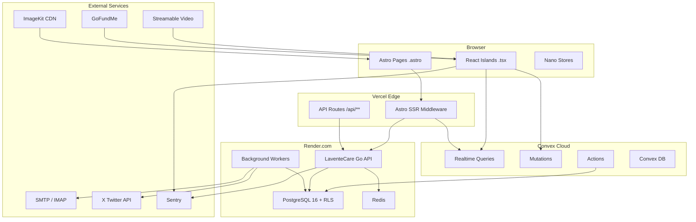

# Systeem Overzicht — Architecture

## Architectuur Diagram



---

## Technology Stack

| Laag | Technologie | Versie | Doel |
|---|---|---|---|
| **Frontend Framework** | Astro (SSR/Hybrid) | 5+ | Pagina rendering, routing, middleware |
| **Styling** | Tailwind CSS | v4 | Design system, utility-first CSS |
| **Interactive Islands** | React | 19+ | Partiele hydration voor dynamische UI |
| **State Management** | Nano Stores | - | Lichtgewicht client-side state |
| **Realtime Data** | Convex | Latest | Live database, mutations, reacties |
| **Backend (IAM)** | Go + Chi Router | 1.22+ | Auth, email, multi-tenancy |
| **Database (Backend)** | PostgreSQL | 16+ | Infra-data met Row Level Security |
| **Cache/Pub-Sub** | Redis | 7+ | SSE multiplexing, presence tracking |
| **Media CDN** | ImageKit | - | Foto opslag en transformatie |
| **Video Hosting** | Streamable | - | Aftermovies en event video's |
| **Deployment** | Vercel | - | Frontend + Edge functions |
| **Backend Hosting** | Render.com | - | Go backend en PostgreSQL |
| **Monitoring** | Sentry | - | Error tracking frontend + backend |

---

## Request Flow

### Paginabezoek (SSR)
```
Browser → Vercel Edge → Astro SSR →
  ├─ Middleware: JWT validatie (→ Go /auth/me)
  ├─ Server-side Convex query (voor initial data)
  └─ HTML response met gehydrateerde islands
```

### Realtime Data (Islands)
```
React Island → Convex subscription →
  └─ Live updates via WebSocket zonder polling
```

### Admin Actie (bijv. email versturen)
```
React Island → Astro API route (/api/**) → Go Backend →
  ├─ RBAC validatie (JWT + rol check)
  ├─ PostgreSQL transactie
  └─ SMTP delivery via email worker
```

---

## Deployment Topologie

| Component | Platform | URL |
|---|---|---|
| Frontend | Vercel | dekoninklijkeloop.nl |
| Convex | Convex Cloud | *.convex.cloud |
| Go Backend | Render.com | api.dekoninklijkeloop.nl |
| PostgreSQL | Render.com (managed) | intern |
| Redis | Render.com (managed) | intern |
| Media | ImageKit CDN | ik.imagekit.io |

---

*← [Terug naar docs/README.md](../README.md) · Volgende: [frontend-architecture.md](./frontend-architecture.md)*
